# MindLoom — AI Quiz Hub

## 📖 Overview

MindLoom is an interactive quiz application that blends **AI‑driven automation** with **real‑time participation** and **detailed performance analytics**. It offers flexible quiz creation, multiple participation modes, and comprehensive insights, making learning engaging, modern, and data‑driven.

---

## ✨ Features

- **Quiz Creation**  
  Create quizzes instantly using **AI‑generated prompts** or build them manually by entering questions and options.

- **Quiz Modes**

  - **Live Mode:** Real‑time participation with instantly updating leaderboards and final rankings.
  - **Async Mode:** Self‑paced attempts with leaderboards revealed after the deadline.

- **Performance Analytics**  
  Detailed post‑quiz stats including:

  - Accuracy percentage
  - Score achieved
  - Rank and leaderboard position
  - Attempt timestamps
  - XP earned

- **Innovation**  
  Unique combination of **AI quiz generation** and **real‑time WebSocket leaderboards**, delivering a highly interactive and modern learning experience.

---

## 👀 WalkThrough

- **Home Page**
  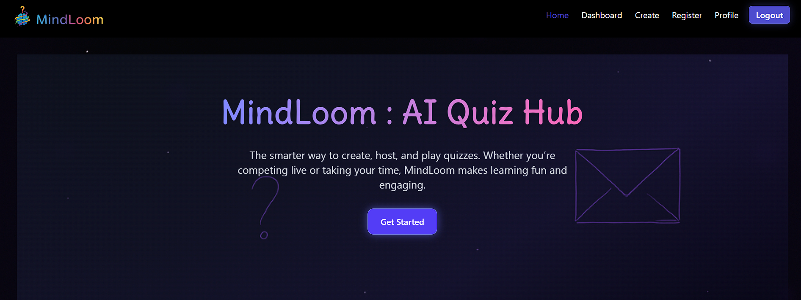
  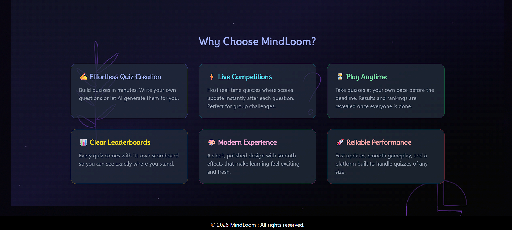

- **Profile Page**
  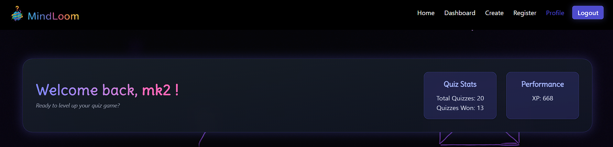
  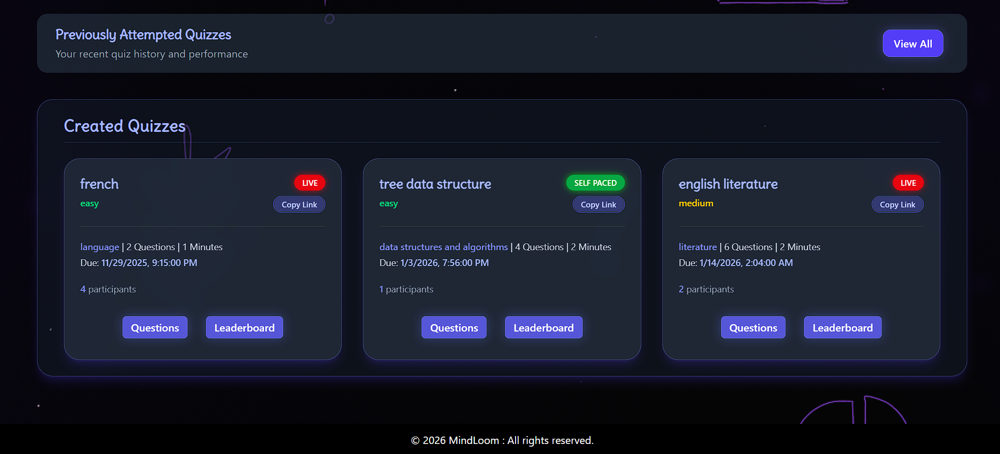

- **Create Quiz : AI generate or Manually**
  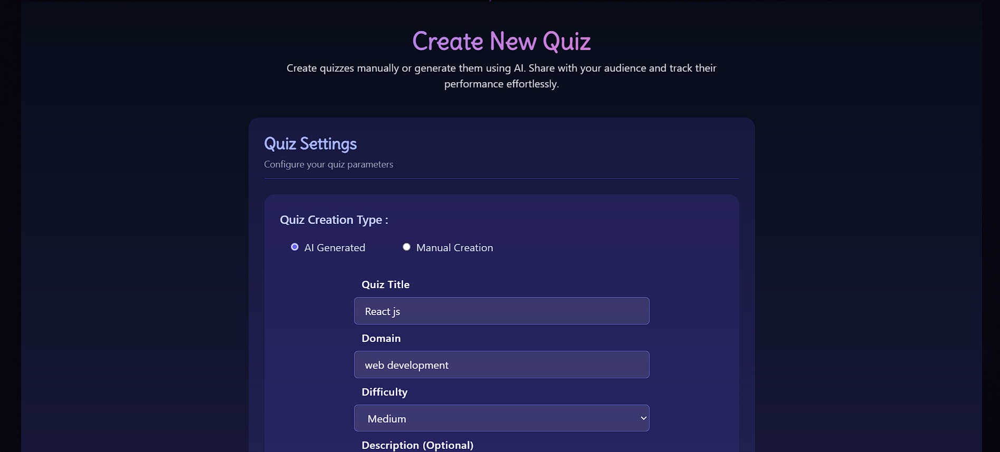
  

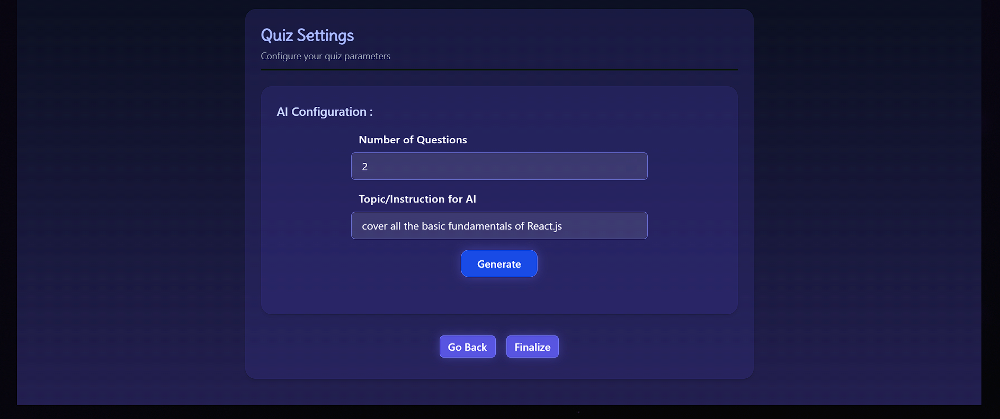

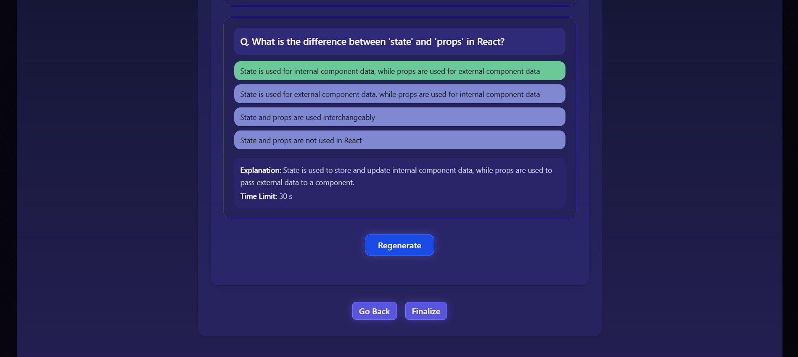

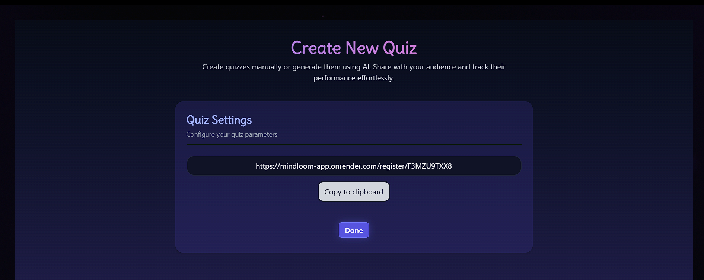

- **Register for Quiz**
  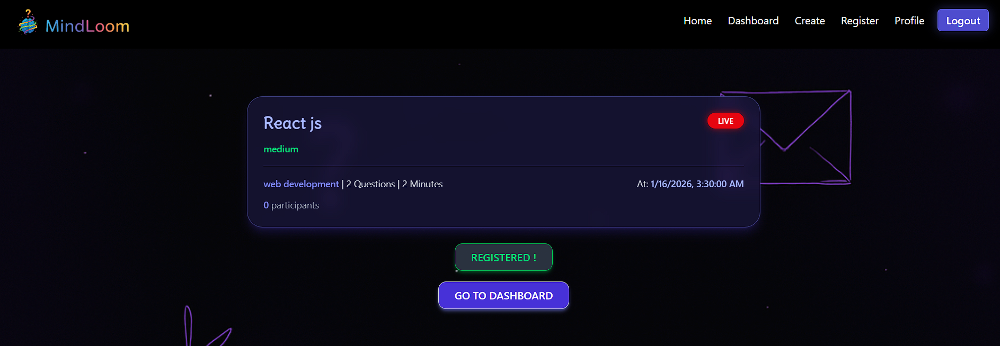

- **Dashboard**
  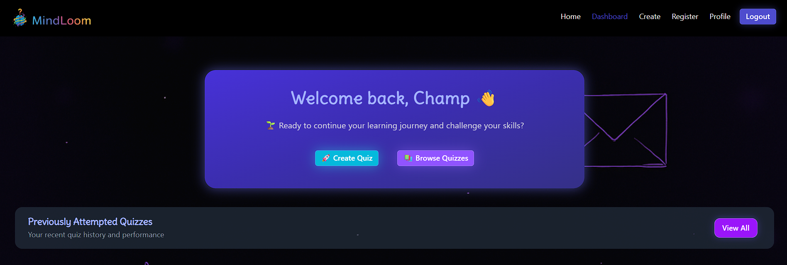
  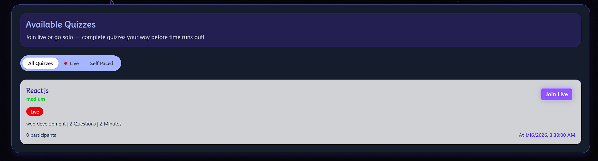

- **Play Quiz : Live or self paced**
  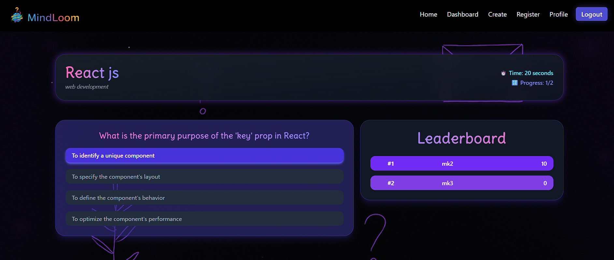

- **Detailed Post Quiz Analysis**
  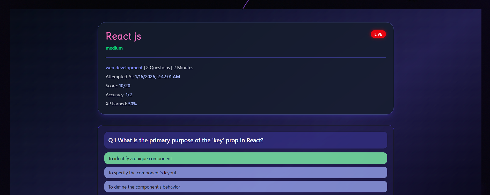
  

---

## 🛠️ Tech Stack

- **Frontend:** React, Tailwind CSS
- **Backend:** Node.js, Express
- **Database:** MongoDB , Redis (for caching the leaderboard)
- **Real‑Time Updates:** Socket.io
- **AI Integration:** OpenAI API

---

## 🚀 Getting Started

1. Clone the repository:
   ```bash
   git clone https://github.com/ManmeetKaur-28/MindLoom.git
   ```
2. Install dependencies
   ```bash
   npm install
   ```
3. Start the development server
   ```bash
   npm run dev
   ```
4. Access the app at https://mindloom-app.onrender.com

---

## 📊 Future Enhancements

- Enhanced visualization of analytics with **charts** and **graphs**
- Gamification features like **badges** and **streak tracking**
